
# Splash Auto Mobile app 

### Defining Purpose and Problem

>  Identify the problem you’re trying to solve by building this particular marketplace App?

Have you ever sat in your friends car and were too shy to let them know their vehicle smells like Shrek's feet? Have you had a proper glance at your car and said to yourself "Wow, my car looks like a swamp... Ill clean it this weekend"

I am sorry to tell you this but this weekend will never arrive.

Driving around various place, I see vehicles that are constantly not being taken care of and thus leading to depreciating your vehicles value, at the end of the day Exterior & Interior is everything.

Splash Mobile Auto Wash is designed to fix this problem, It is specifically designed to make your vehicle look like it just came from a dealerships showroom & also to make sure you don't keep neglecting the vehicles value, We can sort out a package deal for you to take care of the Vehicles health! 

> Why is it a _problem_ that needs solving?

The reason why this is a problem that needs solving is I have done research on how much a private detailer makes and it can be anywhere from $50AUD-$200AUD for detailing a vehicle, Some Vehicle Owners don't get what they pay for & some Detailers/Washers don't earn as much as they should. 

Splash Mobile Auto Wash connects people.

From online social research I see a lot of people asking about professional detailers or just simply want a quick cheap clean and need it ASAP. We ensure security and we ensure the service is provided from both sides.

> Link to GITHUB Repo & Heroku

-   Github
- Heroku

## 
### Splash Mobile Auto Wash

##### Purpose

The primary purposes of this Web app is to ensure owners can receive a cleaning service for their Vehicle from Washers & Washers can earn a payment upon cleaning the vehicle from the owner.

##### Functionality / features
STRIPE has been implemented as a payment system to gain security through a trusted payment system. (Still needs in beta_

CLOUDINARY has been implemented for a user to upload their Identification as an image upload(Both Owners & Washers).

ROLIFY has been implemented so an Owner cannot go under the washer tab t

DEVISE has been implemented so an lorem

### SiteMap
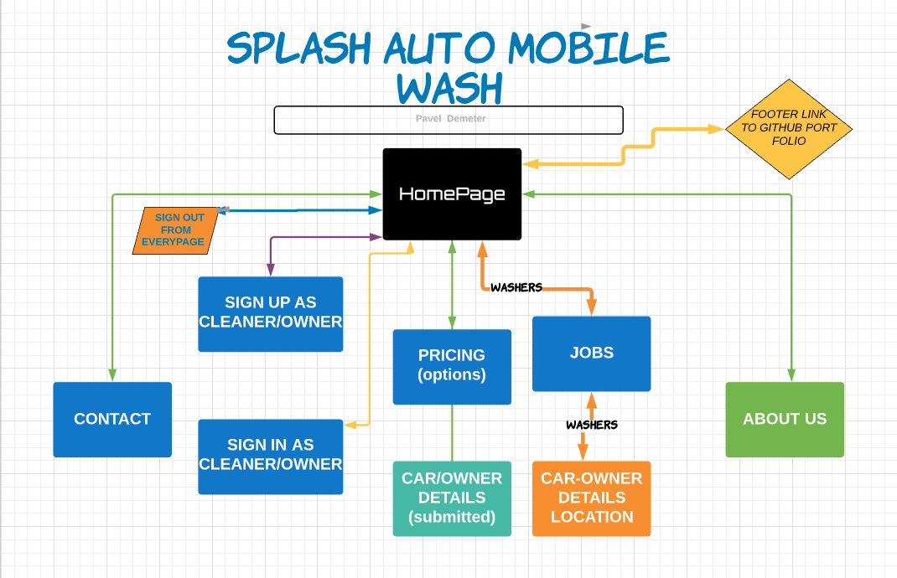

## 

### Screenshots
##### Homepage
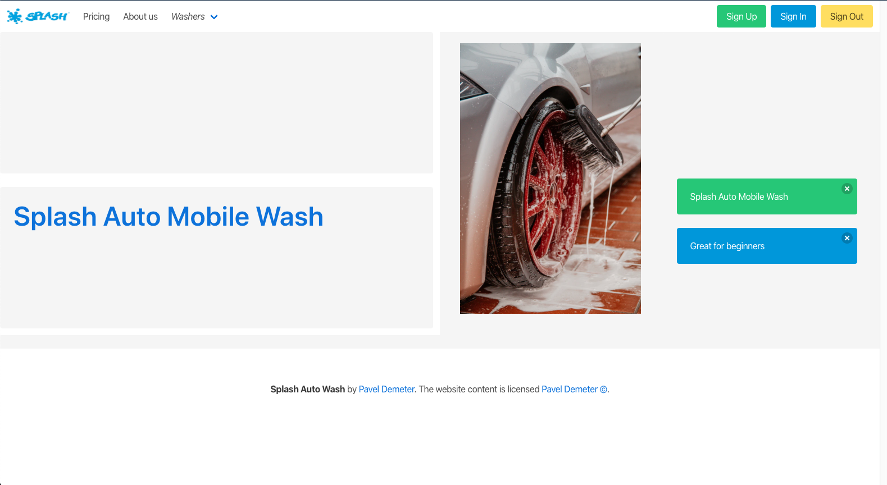
##### Signup 
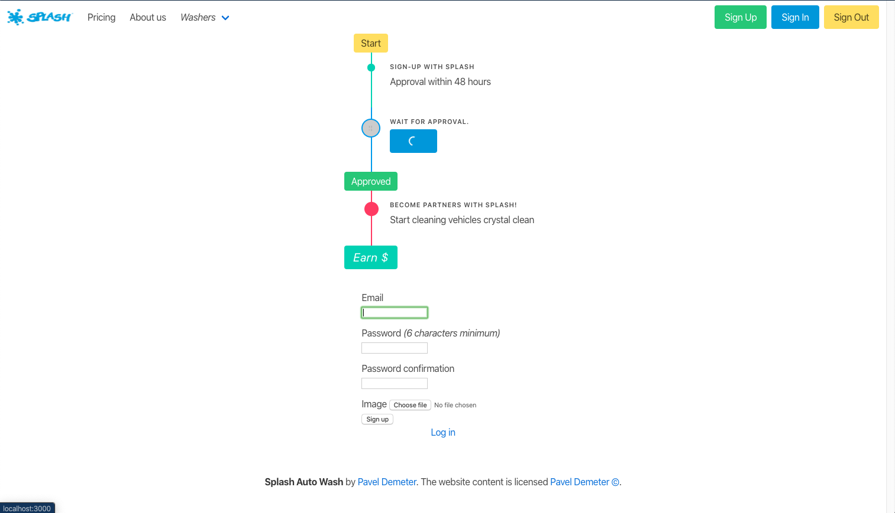
##### About us 
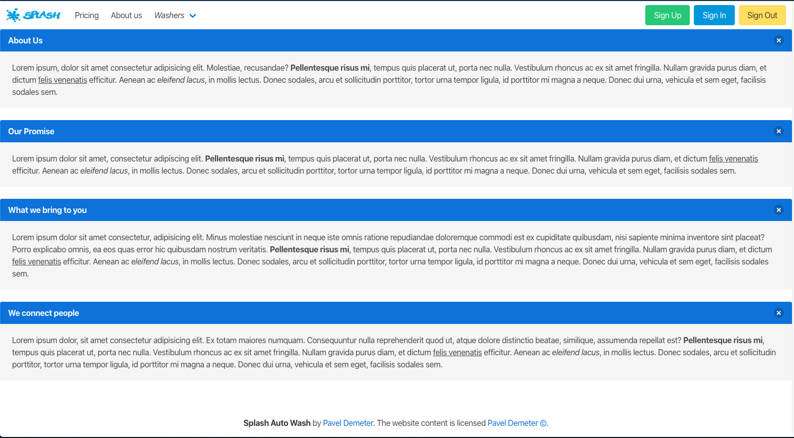
##### Pricing
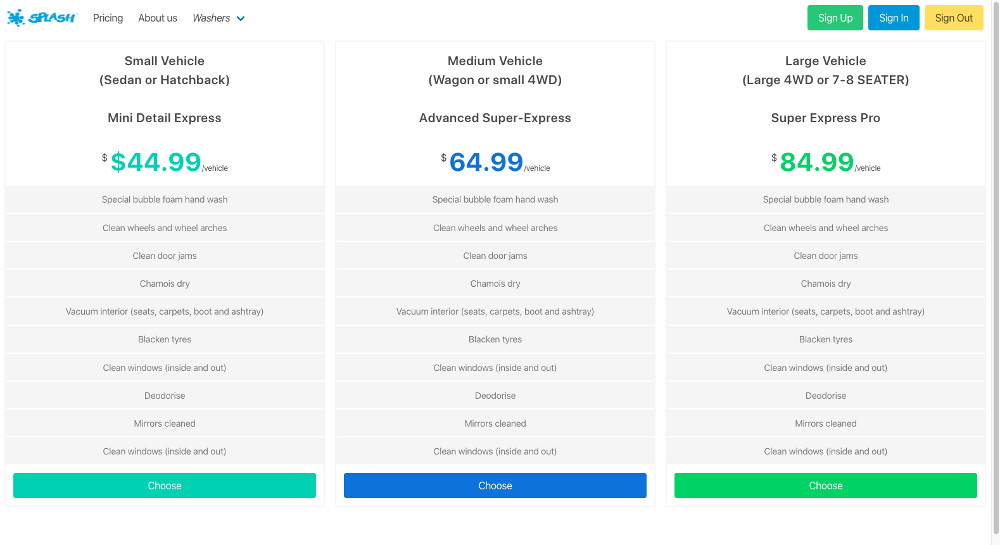
##### Submitting quote
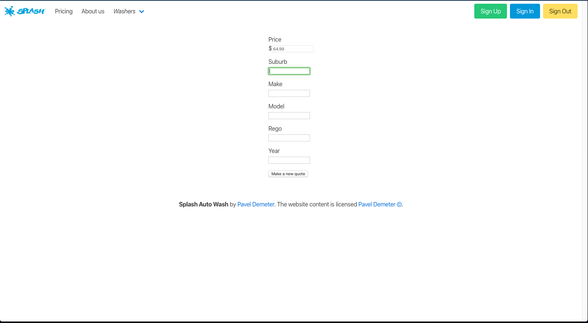
##### Contact 
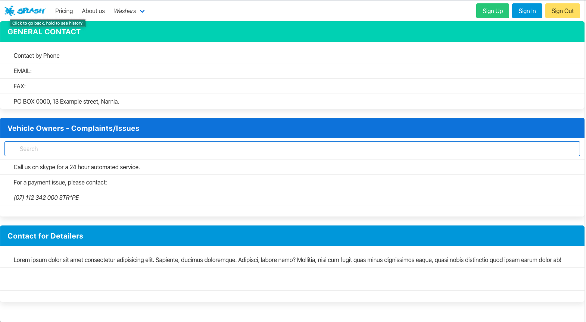
##### iPhone x Homepage
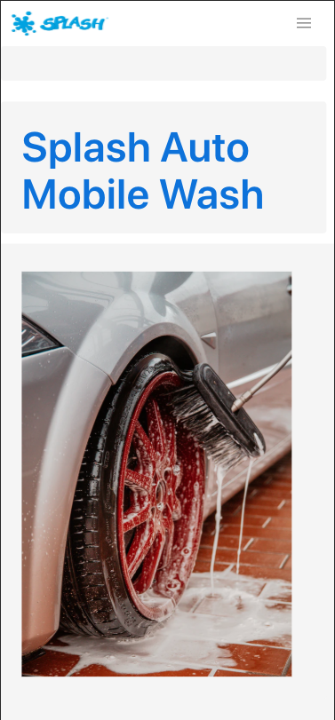
## 

##### Target audience

As the legal age to drive is 17, Splash Auto Mobile Wash has focused on the target audience of people over 18 years of age, for Identification purposes for both owners of vehices and Washers. 

The specific target audience would be car enthuasists, It can also be implemented to small car dealerships as a package, So not only indiviuals but also big organisations which bring a huge market our way.

##### Tech Stack

-   HTML, CSS3, SCSS
- Ruby-on-Rails for development
-   GitHub for version control
-   Heroku for deployment
-   Trello for user stories and work flow.
-   Lucid Chart for site map and ERD

-   Rails Gems (see below) for extending functionalities beyond MVC
 > Detail any third party services that your App will use.

-   Cloudinary: To manage Image upload
-   Stripe: To manage payments
-   GitHub: To manage version control
-   Heroku: To deploy live app
-   Bulma: for styling

#### User Stories
##### As an owner I want to be able to login/signup to the site for access.

Owners will be able to login/signup page to enter the site.

##### As a owner I want to be able to pay for the service with my card details.

Once owner is logged in and made a quote, they can pay through stripe for their service.

##### As a owner I want to be able to views options for vehicle service cleaning.
Owners will have the option to choose from 3 sizes to wash their car. As we offer one service only.

##### As an owner I want to be able to view information about the company and contact details.

The website will have an about page implemented for both owners/washers.

#### Washer User Story

##### As a a washer I want to be able to login/signup to access the site

Washers & vehicle owners will both require ID to sign up to the site, Rolify will take care of the option to view cars to wash after logging in as a washer.

##### As a washer I want to be able to view internships to see what I could apply for

Washer will have their own tab "Washers" information about the vehicle they are cleaning, registration details, suburb, make, model & year of vehicle.

#### Wire-frames

##### Homepage
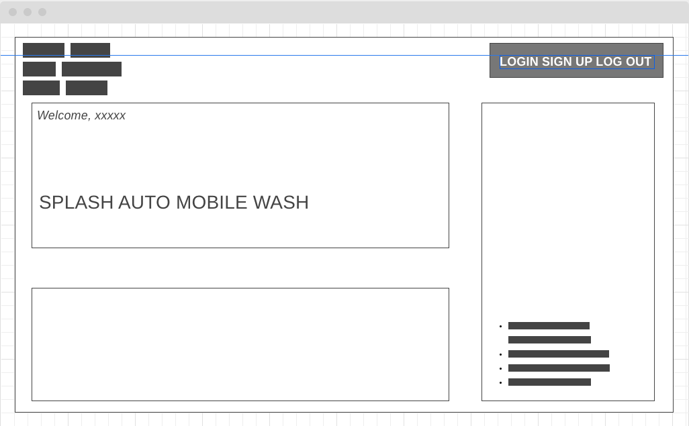
##### About
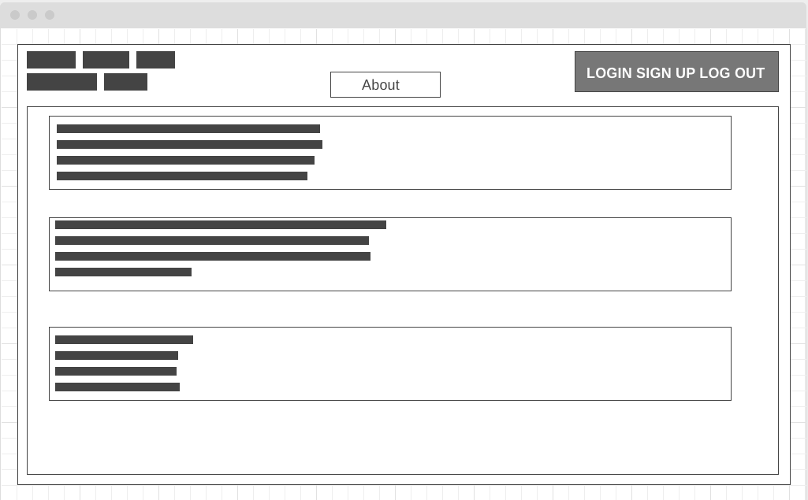
##### Pricing
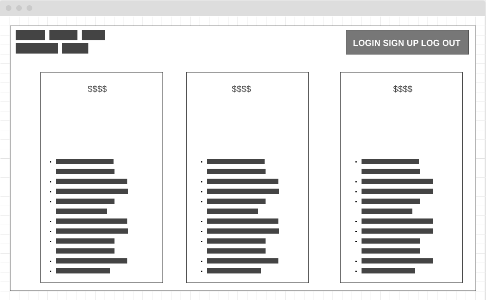
##### Car details
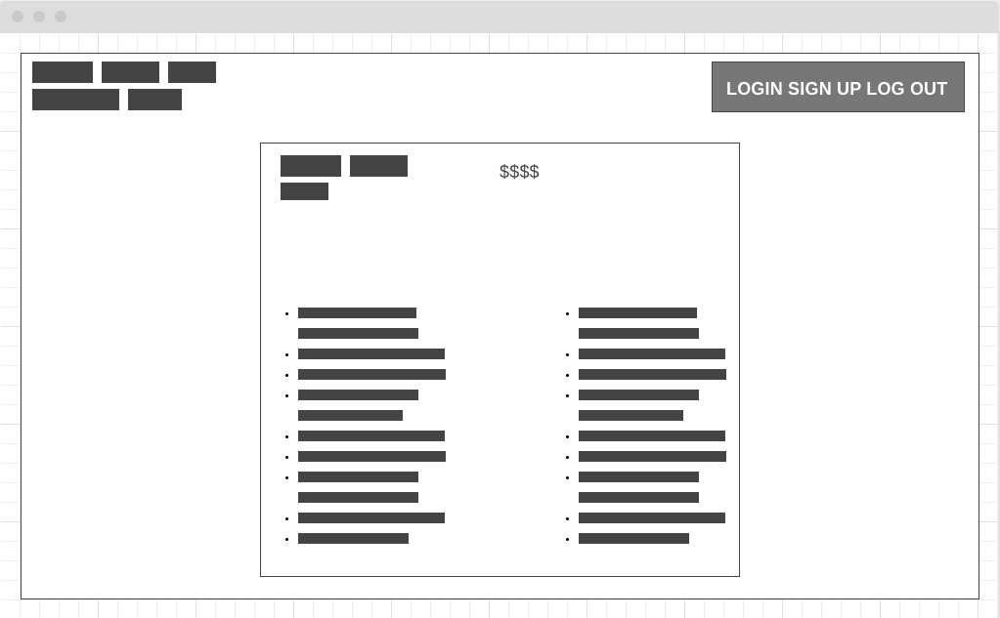
##### Sign up
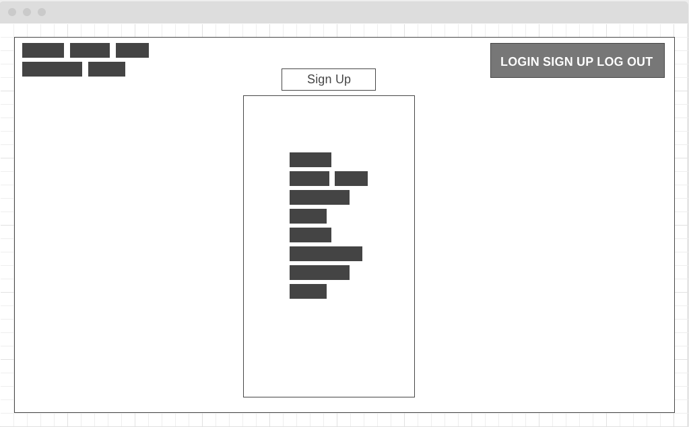
##### Jobs for Washer
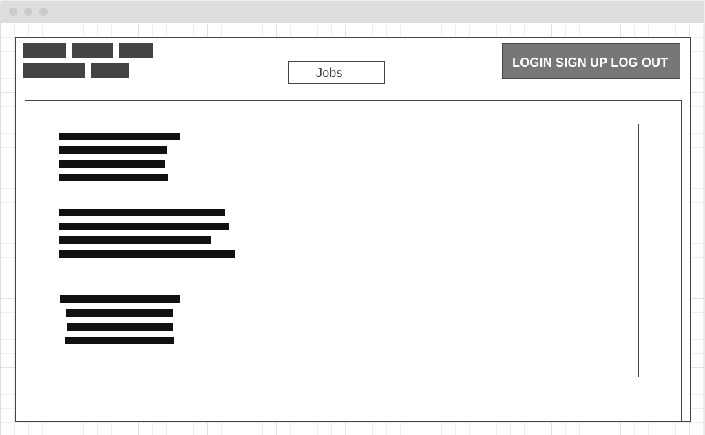
##### Contact us
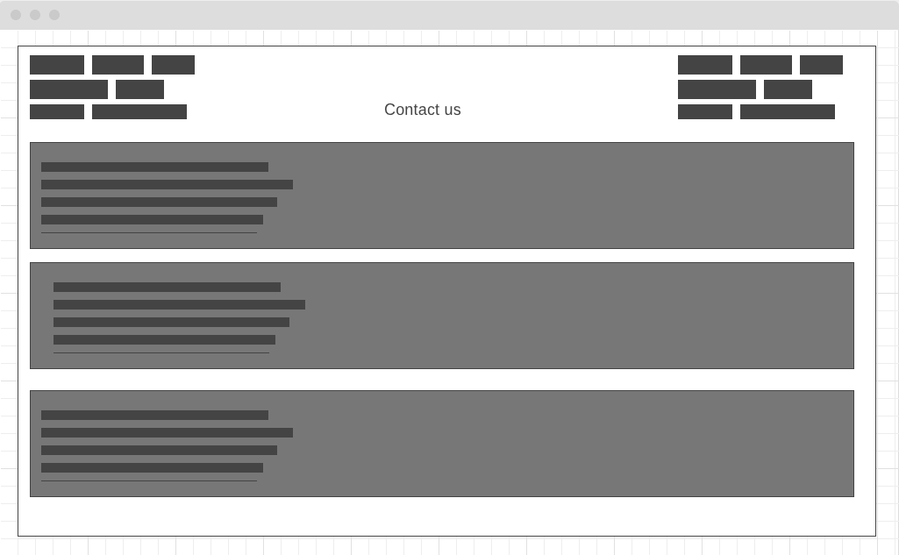

R14

An ERD for your  _app_

R15

Explain the different high-level components (abstractions) in your  _app_

R16

Detail any third party services that your  _app_  will use

R17

Describe your projects  _models_  in terms of the relationships (active record associations) they have with each other

R18

Discuss the database relations to be implemented in your application

R19

Provide your database schema design

R20

Describe the way tasks are allocated and tracked in your project
